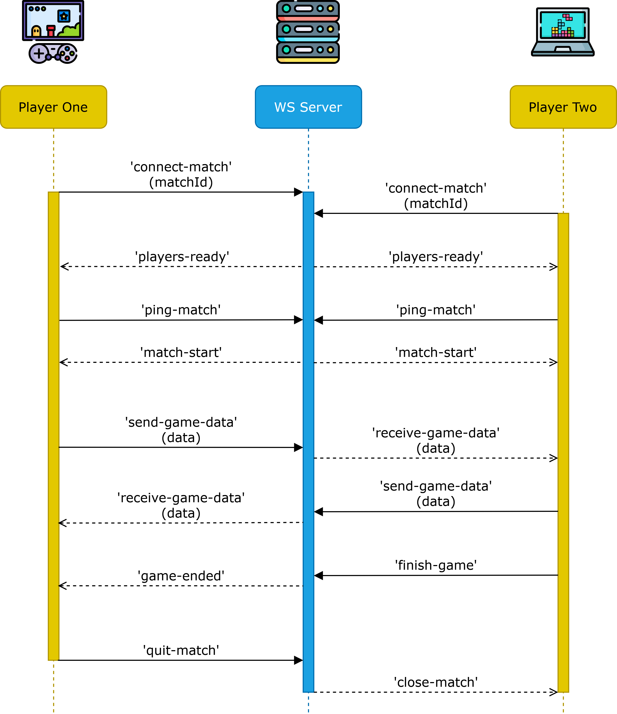

# Eventos de la jugabilidad en línea (GameMatch)

> Si necesitas volver al documento anterior, haz clic [aquí](./server-connect-and-use-es.md).

Después de establecer una solicitud de partida correcta, los jugadores podrán conectarse a una sala dedicada y 
comenzar a jugar sin problemas. Al inicio, deberán conectarse y mandar un ping para establecer conexión. Luego,
la sala estará lista para recibir eventos personalizados entre los jugadores. El juego termina cuando uno de
los jugadores manda el evento de partida finalizada, que lo declara ganador. Finalmente, ambos jugadores
tendrán la opción para volver a jugar enviando una solicitud de nueva partida, o bien, pueden abandonar la
partida.

- [Resumen de eventos](#resumen-de-eventos)

- [Jugadores Listos (players-ready)](#jugadores-listos-players-ready)
- [Partida Iniciada (match-start)](#partida-iniciada-match-start)
- [Datos recibidos por el jugador contrincante (receive-game-data)](#datos-recibidos-por-el-jugador-contrincante-receive-game-data)
- [Partida Terminada (game-ended)](#partida-terminada-game-ended)
- [Repetir juego / Revancha (rematch-request)](#repetir-juego--revancha-rematch-request)
- [Partida cerrada o concluida (close-match)](#partida-cerrada-o-concluida-close-match)

- [Conectarse a la partida (connect-match)](#conectarse-a-la-partida-connect-match)
- [Realizar ping de conexión (ping-match)](#realizar-ping-de-conexión-ping-match)
- [Enviar datos de juego (send-game-data)](#enviar-datos-de-juego-send-game-data)
- [Finalizar partida (finish-game)](#finalizar-partida-finish-game)
- [Enviar solicitud de revancha (send-rematch-request)](#enviar-solicitud-de-revancha-send-rematch-request)
- [Salir de la partida (quit-match)](#salir-de-la-partida-quit-match)

## Resumen de eventos

| Evento                 | Tipo     | Descripción                                                             |
|------------------------|----------|-------------------------------------------------------------------------|
| `players-ready`        | Entrante | Avisa que ambos jugadores estan listos para comenzar la partida.        |
| `match-start`          | Entrante | Avisa que la partida ha iniciado y esta lista para recibir eventos.     |
| `receive-game-data`    | Entrante | Avisa que el otro jugador envió un evento a su partida.                 |
| `game-ended`           | Entrante | Avisa que un jugador ha ganado la partida.                              |
| `rematch-request`      | Entrante | Avisa que el otro jugador envió una solicitud para volver a jugar.      |
| `close-match`          | Entrante | Avisa que el otro jugador salió de la partida.                          |
| `connect-match`        | Saliente | Se utiliza para conectarse a la partida creada por la solicitud.        |
| `ping-match`           | Saliente | Se utiliza para establecer un primer contacto y determinar la latencia. |
| `send-game-data`       | Saliente | Envía datos hacia la partida del otros jugador.                         |
| `finish-game`          | Saliente | Se utiliza para declarar como ganador al jugador que manda este evento. |
| `send-rematch-request` | Saliente | Envía una solicitud para volver a jugar la misma partida.               |
| `quit-match`           | Saliente | Se utiliza para salir de una partida que ha finalizado.                 |

<details>
<summary>Diagrama de secuencia:</summary>

 

</details>

<details><summary>Orden ideal de los eventos:</summary>

  1. Jugador 1 y 2 se conectan a la sala con `connect-match` (no importa el orden).
  2. Servidor envía el evento `players-ready` a ambos jugadores.
  3. Jugador 1 y 2 envían el evento `ping-match` para verificar conexión (no importa el orden).
  4. Servidor envía el evento `match-start` para comenzar el intercambio de datos.
  5. Ambos jugadores envían datos por el evento `send-game-data` y los reciben con `receive-game-data`.
  6. El jugador que termina primero su partida envía el evento `finish-game`.
  7. El jugador perdedor recibe el evento `game-ended`, lo que detiene su partida.
  8. Los jugadores pueden solicitar una revancha mandando el evento `send-rematch-request`.
    - Si ambos jugadores envían el evento, se vuelve a inicia el ciclo desde el punto 2.
  9. Los jugadores pueden decidir no continuar mandando el evento `quit-match`.
    - El jugador que mande primero el evento enviará el evento `close-match` al otro jugador.
    - Si existe una solicitud de revancha, esta se cancela automáticamente.

  Notas:
  - En el punto 6, el jugador que manda el evento no recibirá `game-ended`, por lo que al mandarlo, el cliente
  de juego debe finalizar su partida manualmente.
  - Al igual que el anterior, recibir `quit-match` implica que no se puede jugar una revancha, por lo que
  el cliente de juego debe gestionar la salida de la partida.
</details>

## Jugadores Listos (players-ready)

| Resumen         |                                                                          |
|-----------------|--------------------------------------------------------------------------|
| __Evento__      | `players-ready`                                                          |
| __Tipo__        | Evento entrante (_Listen_).                                              |
| __Descripción__ | Aviso que ambos jugadores ya se encuentran listos en la sala para jugar. |
| __Respuesta__   | `matchId` (_string_): ID de la partida asociada a la solicitud.          |

Este evento se recibe cuando ambos jugadores se han conectado a la sala con `connect-match`.
Esta acción permite avanzar con el flujo, enviando por parte del jugador el evento `ping-match`.

Ejemplo de respuesta:
```jsonc
{
  "event": "players-ready",
  "msg": "Both players are ready to start. Send 'ping-match' to sync times.",
  "data": {
    "matchId": "30c3d082-bcd9-48b0-9a90-76212636bc6f"
  }
}
```

## Partida Iniciada (match-start)

| Resumen         |                                                                 |
|-----------------|-----------------------------------------------------------------|
| __Evento__      | `match-start`                                                   |
| __Tipo__        | Evento entrante (_Listen_).                                     |
| __Descripción__ | Evento que inicia la partida en ambos juegos.                   |
| __Respuesta__   | `matchId` (_string_): ID de la partida asociada a la solicitud. |

Cuando ambos jugadores realizaron la prueba de ping, la partida inicia en ambos clientes. Esto habilita el
evento `send-game-data`, que permite enviar datos directamente al otro cliente de juego. 

Como nota, no es necesario iniciar la partida inmediatamente. Pueden enviar eventos previos para configurar las
partidas y luego iniciar.

Ejemplo de respuesta:
```jsonc
{
  "event": "match-start",
  "msg": "Match is ready to receive events. Send it with 'send-game-data'.",
  "data": {
    "matchId": "30c3d082-bcd9-48b0-9a90-76212636bc6f"
  }
}
```

## Datos recibidos por el jugador contrincante (receive-game-data)

| Resumen         |                                                       |
|-----------------|-------------------------------------------------------|
| __Evento__      | `receive-game-data`                                   |
| __Tipo__        | Evento entrante (_Listen_).                           |
| __Descripción__ | Indica que se recibió información del otro juego.     |
| __Respuesta__   | `any`: Datos del otro juego dentro del objeto `data`. |

Durante el juego, su contrincante puede mandar datos de todo tipo, como beneficios, castigos, actualizaciones,
entre otros. Esta información llega dentro del parámetro `data`. Pueden establecer distintos parámentros, como
subeventos, valores de puntaje, vida, tipo de beneficio o perjuicio, etc. Es importante coordinarse entre
equipos de desarrollo para estandarizar los datos enviados, ya sea entre todos los clientes de juego, o uno en
particular.

Ejemplo de respuesta:

> _Los datos recibidos dentro de `data` variarán según el estándar establecido. No es necesario seguir este_
> _estándar por obligación._
```jsonc
{
  "event": "receive-game-data",
  "msg": "Event received from match.",
  "data": {
    "subEvent": "attack",
    "attackType": "MID-RANGE-ATTACK",
    "opDamage": 30,
    "opLives": 940,
    "opScore": 90291,
    "skills": {
      "sword": 3,
      "shield": 5,
      "bow": 10, 
    }
  }
}
```

## Partida Terminada (game-ended)

| Resumen         |                                                            |
|-----------------|------------------------------------------------------------|
| __Evento__      | `game-ended`                                               |
| __Tipo__        | Evento entrante (_Listen_).                                |
| __Descripción__ | Evento que indica el término de la partida.                |
| __Respuesta__   | `matchStatus` (_string_): Estado de la partida (FINISHED). |

Recibir este evento indica que la partida terminó, dando como ganador al oponente. Esto se realizó asi por
tiempo y evitar validaciones innecesarias, confiando en los clientes de juego y en sus desarrolladores. En un
futuro, esto debe cambiarse para que la validación venga del servidor.

Con esta llamada, el jugador muestra la pantalla de derrota, la posibilidad de revancha mandando el evento
`send-match-request`, o bien salir de la partida, activando el evento `quit-match`.

Ejemplo de respuesta:
```jsonc
{
  "event": "game-ended",
  "msg": "Game over! Player_Two wins!",
  "data": {
    "matchStatus": "FINISHED"
  }
}
```

## Repetir juego / Revancha (rematch-request)

| Resumen         |                                                       |
|-----------------|-------------------------------------------------------|
| __Evento__      | `rematch-request`                                     |
| __Tipo__        | Evento entrante (_Listen_).                           |
| __Descripción__ | Evento que indica que el oponente desea una revancha. |
| __Respuesta__   | `null`: No se recibe nada en data.                    |

Recibir este evento indica que el oponente desea una revancha. Esta función permite volver a competir en una
partida con el mismo jugador sin necesidad de volver a crear una solicitud de partida. El jugador puede aceptar
esta solicitud mandando el evento `send-rematch-request`, lo cual reinicia el flujo de eventos recibiendo el
evento `players-ready`.

Ejemplo de respuesta:
```jsonc
{
  "event": "rematch-request",
  "msg": "Player 'Player_Two' wants to play again. Send 'send-rematch-request' to accept.",
  "data": null
}
```

## Partida cerrada o concluida (close-match)

| Resumen         |                                                             |
|-----------------|-------------------------------------------------------------|
| __Evento__      | `close-match`                                               |
| __Tipo__        | Evento entrante (_Listen_).                                 |
| __Descripción__ | Evento que indica que la partida ha concluido por abandono. |
| __Respuesta__   | `null`: No se recibe nada en data.                          |

Recibir este evento indica que el oponente abandonó la sala después de terminar el juego, por lo que no es
posible solicitar una revancha. Con lo que solo queda la opción de abandonar la partida.

Ejemplo de respuesta:
```jsonc
{
  "event": "close-match",
  "msg": "Player 'Player_Two' has quit to the game. Rematch is not possible.",
  "data": null
}
```

## Conectarse a la partida (connect-match)

| Resumen         |                                          |
|-----------------|------------------------------------------|
| __Evento__      | `connect-match`                          |
| __Tipo__        | Evento saliente (_Trigger_).             |
| __Descripción__ | Inicia la conexión a la partida creada.  |
| __Parámetros__  | Ninguno: No se requieren parámetros.     |
| __Respuesta__   | `matchId` (_String_): ID de la partida.  |

Si se aceptó una solicitud de partida, se habilitará la sala de partida para conectarse. Este evento establece
la conexión con la sala. Si ambos jugadores se conectan, se gatillará el evento `players-ready`. El evento
retornará un error en caso que no hubiera una partida asociada al jugador, no se hubiera aceptado la solicitud
aún o ya se haya conectado el jugador a la partida.

Ejemplo de solicitud correcta:
```jsonc
// Evento enviado por el jugador
{
  "event": "connect-match"
}

// Respuesta entregada por el servidor
{
  "event": "connect-match",
  "status": "OK",
  "msg": "You are in the match room. Wait until the 'players-ready' event triggered",
  "data": {
    "matchId": "30c3d082-bcd9-48b0-9a90-76212636bc6f"
  }
}
```

Ejemplo de solicitudes erróneas:
```jsonc
// Evento enviado por el jugador
{
  "event": "connect-match",
}

// Respuesta entregada por el servidor si el jugador no tiene una partida asociada
{
  "event": "connect-match",
  "status": "ERROR",
  "msg": "You do not have an associated match.",
  "data": {
    "playerStatus": "AVAILABLE"
  }
}

// Respuesta entregada por el servidor si el jugador no ha aprobado su solicitud de partida
{
  "event": "connect-match",
  "status": "ERROR",
  "msg": "You need to approve this match request first.",
  "data": {
    "matchId": "30c3d082-bcd9-48b0-9a90-76212636bc6f",
    "matchStatus": "REQUESTED"
  }
}

// Respuesta entregada por el servidor si el jugador ya se ha conectado a su partida
{
  "event": "connect-match",
  "status": "ERROR",
  "msg": "You are already connected to this match. Wait 'players-ready' event to sync.",
  "data": {
    "matchId": "30c3d082-bcd9-48b0-9a90-76212636bc6f",
    "matchPlayerStatus": "WAITING_SYNC"
  }
}
```

## Realizar ping de conexión (ping-match)

| Resumen         |                                                   |
|-----------------|---------------------------------------------------|
| __Evento__      | `ping-match`                                      |
| __Tipo__        | Evento saliente (_Trigger_).                      |
| __Descripción__ | Comprueba si existe latencia entre los jugadores. |
| __Parámetros__  | Ninguno: No se requieren parámetros.              |
| __Respuesta__   | `matchId` (_String_): ID de la partida.           |

Este evento se envía cuando ambos jugadores ya se han conectado a la partida y han recibido
el evento `players-ready`. Con este evento se comprueban situaciones de latencia con el fin
de mitigar problemas (o es lo que debería hacer, ya que solo está para avanzar en los pasos).
Cuando ambos jugadores ingresen su solicitud de ping, el servidor enviará simultáneamente el
evento `match-start`. Este evento no se puede mandar si no hubiera una partida asociada al
jugador, no se hubiera aceptado la solicitud aún, ya se haya realizado ping a la partida o
la partida ya haya iniciado o terminado.

Ejemplo de solicitud correcta:
```jsonc
// Evento enviado por el jugador
{
  "event": "ping-match"
}

// Respuesta entregada por el servidor
{
  "event": "ping-match",
  "status": "OK",
  "msg": "You send your ping successfully.",
  "data": {
    "matchId": "30c3d082-bcd9-48b0-9a90-76212636bc6f"
  }
}
```

Ejemplo de solicitudes erróneas:
```jsonc
// Evento enviado por el jugador
{
  "event": "ping-match",
}

// Respuesta entregada por el servidor si el jugador no tiene una partida asociada
{
  "event": "ping-match",
  "status": "ERROR",
  "msg": "You do not have an associated match.",
  "data": {
    "playerStatus": "AVAILABLE"
  }
}

// Respuesta entregada por el servidor si el jugador no ha aprobado su solicitud de partida
{
  "event": "ping-match",
  "status": "ERROR",
  "msg": "You need to approve this match request first.",
  "data": {
    "matchId": "30c3d082-bcd9-48b0-9a90-76212636bc6f",
    "matchStatus": "REQUESTED"
  }
}

// Respuesta entregada por el servidor si el jugador aun no se conecta a la partida.
{
  "event": "ping-match",
  "status": "ERROR",
  "msg": "You need to establish connection first with 'connect-match'.",
  "data": {
    "matchId": "30c3d082-bcd9-48b0-9a90-76212636bc6f",
    "matchPlayerStatus": "WAITING_CONNECTION"
  }
}

// Respuesta entregada por el servidor si el jugador ya esta jugando.
{
  "event": "ping-match",
  "status": "ERROR",
  "msg": "The match has started. You cannot sent this event.",
  "data": {
    "matchId": "30c3d082-bcd9-48b0-9a90-76212636bc6f",
    "matchPlayerStatus": "PLAYING"
  }
}
```

## Enviar datos de juego (send-game-data)

| Resumen         |                                               |
|-----------------|-----------------------------------------------|
| __Evento__      | `send-game-data`                              |
| __Tipo__        | Evento saliente (_Trigger_).                  |
| __Descripción__ | Envía información al otro jugador.            |
| __Parámetros__  | `Any`: Cualquier parámetro necesario.         |
| __Respuesta__   | `null`: No se reciben parámetros adicionales. |

Luego de los pasos anteriores, la partida iniciará con el evento `match-start`. Desde este punto, se puede
comenzar a enviar datos al otro cliente de juego con este evento, y el oponente los recibirá con el evento
`receive-game-data`. Se pueden mandar datos de todo tipo, como beneficios, castigos, actualizaciones, entre
otros, ya sea en parámetros individuales u objetos anidados. Toda la información llega dentro del parámetro
`data`. Pueden establecer distintos parámentros, como subeventos, valores de puntaje, vida, tipo de beneficio
o perjuicio, etc. Es importante coordinarse entre equipos de desarrollo para estandarizar los datos enviados,
ya sea entre todos los clientes de juego, o uno en particular.

Este evento no se puede gatillar si la partida no se encuentra en estado `PLAYING`.

Ejemplo de solicitud correcta:
```jsonc
// Evento enviado por el jugador
{
  "event": "send-game-data"
}

// Respuesta entregada por el servidor
{
  "event": "send-game-data",
  "status": "OK",
  "msg": "Data sended successfully.",
  "data": null
}
```

Ejemplo de solicitudes erróneas:
```jsonc
// Evento enviado por el jugador
{
  "event": "send-game-data",
}

// Respuesta entregada por el servidor si el jugador no tiene una partida asociada
{
  "event": "send-game-data",
  "status": "ERROR",
  "msg": "You do not have an associated match.",
  "data": {
    "playerStatus": "AVAILABLE"
  }
}

// Respuesta entregada por el servidor si la partida aun no ha comenzado
{
  "event": "send-game-data",
  "status": "ERROR",
  "msg": "The match is not started or is finished.",
  "data": {
    "matchStatus": "FINISHED"
  }
}
```

## Finalizar partida (finish-game)

| Resumen         |                                         |
|-----------------|-----------------------------------------|
| __Evento__      | `finish-game`                           |
| __Tipo__        | Evento saliente (_Trigger_).            |
| __Descripción__ | Termina la partida actual.              |
| __Parámetros__  | Ninguno: No se requieren parámetros.    |
| __Respuesta__   | `matchId`: Identificador de la partida. |
|                 | `matchStatus`: Estado de la partida.    |

En base a la coordinación entre juegos, este evento es gatillado por el cliente de juego que haya alcanzado
la condición de victoria. Esto mandará una notificación al oponente para indicar que usted ha ganado la
partida. Este evento no puede mandarse si la partida aun no comienza, ya finalizó o el jugador no tiene una
partida asociada.

Ejemplo de solicitud correcta:
```jsonc
// Evento enviado por el jugador
{
  "event": "finish-game"
}

// Respuesta entregada por el servidor
{
  "event": "finish-game",
  "status": "OK",
  "msg": "Game over! 'Player_Two' wins!",
  "data": {
    "matchId": "30c3d082-bcd9-48b0-9a90-76212636bc6f"
  }
}
```

Ejemplo de solicitudes erróneas:
```jsonc
// Evento enviado por el jugador
{
  "event": "finish-game",
}

// Respuesta entregada por el servidor si el jugador no tiene una partida asociada
{
  "event": "finish-game",
  "status": "ERROR",
  "msg": "You do not have an associated match.",
  "data": {
    "playerStatus": "AVAILABLE"
  }
}

// Respuesta entregada por el servidor si la partida ya fue finalizada por algún jugador
{
  "event": "finish-game",
  "status": "ERROR",
  "msg": "The match has already finished.",
  "data": {
    "matchId": "30c3d082-bcd9-48b0-9a90-76212636bc6f",
    "matchStatus": "FINISHED"
  }
}

// Respuesta entregada por el servidor si la partida aún no ha comenzado
{
  "event": "finish-game",
  "status": "ERROR",
  "msg": "The match has not been started yet.",
  "data": {
    "matchId": "30c3d082-bcd9-48b0-9a90-76212636bc6f",
    "matchStatus": "WAITING_PLAYERS"
  }
}
```

## Enviar solicitud de revancha (send-rematch-request)

| Resumen         |                                               |
|-----------------|-----------------------------------------------|
| __Evento__      | `send-rematch-request`                        |
| __Tipo__        | Evento saliente (_Trigger_).                  |
| __Descripción__ | Envía una solicitud de revancha al oponente.  |
| __Parámetros__  | Ninguno: No se requieren parámetros.          |
| __Respuesta__   | `null`: No se reciben parámetros adicionales. |

Este evento permite al jugador mandar una solicitud de revancha al contrincante. De esta manera, no
es necesario salir de la partida y volver a crear una solicitud de partida para jugar contra el mismo
oponente. Enviar este evento  manda al oponente el evento `rematch-request` y establece al jugador la
acción de repetir la partida. Si el contrincante acepta, el servidor automáticamente mandará el evento
`players-ready`, iniciando el ciclo nuevamente.

Esta solicitud no se puede mandar si el usuario no tiene una partida, si la partida no ha terminado, o
si el contrincante ya salió de la sala de partida.


Ejemplo de solicitud correcta:
```jsonc
// Evento enviado por el jugador
{
  "event": "send-rematch-request"
}

// Respuesta entregada por el servidor
{
  "event": "send-rematch-request",
  "status": "OK",
  "msg": "Rematch request sent.",
  "data": null
}
```

Ejemplo de solicitudes erróneas:
```jsonc
// Evento enviado por el jugador
{
  "event": "send-rematch-request",
}

// Respuesta entregada por el servidor si el jugador no tiene una partida asociada
{
  "event": "send-rematch-request",
  "status": "ERROR",
  "msg": "You do not have an associated match.",
  "data": {
    "playerStatus": "AVAILABLE"
  }
}

// Respuesta entregada por el servidor si la partida aun no finaliza.
{
  "event": "send-rematch-request",
  "status": "ERROR",
  "msg": "You can only send a rematch request when the current match is over.",
  "data": {
    "matchId": "30c3d082-bcd9-48b0-9a90-76212636bc6f",
    "matchStatus": "PLAYING"
  }
}

// Respuesta entregada por el servidor si el oponente abandonó la partida
{
  "event": "send-rematch-request",
  "status": "ERROR",
  "msg": "Player 'Player_Two' has quit the game.",
  "data": {
    "playerId": "30c3d082-bcd9-48b0-9a90-76212636bc6f",
    "playerStatus": "AVAILABLE"
  }
}
```

## Salir de la partida (quit-match)

| Resumen         |                                                       |
|-----------------|-------------------------------------------------------|
| __Evento__      | `quit-match`                                          |
| __Tipo__        | Evento saliente (_Trigger_).                          |
| __Descripción__ | Abandona la partida actual.                           |
| __Parámetros__  | Ninguno: No se requieren parámetros.                  |
| __Respuesta__   | `playerStatus` (_String_): Estado actual del jugador. |

Este evento permite salir de la partida luego que esta haya finalizado. De esta forma, cualquier solicitud
de revancha queda anulada. En caso de ser el primer jugador en salir, este evento enviará al oponente
`close-match`, lo que indica que deberá salir de la partida para iniciar otra con otro jugador. En el caso
de ser el segundo jugador, el evento eliminará su partida asociada, sin mandar evento de cierre de partida.
Este evento también actualiza el estado del jugador de `IN_MATCH` a `AVAILABLE`, con el fin que pueda
establecer otra partida con otro jugador. El evento no se puede mandar si el jugador no tiene una partida o
esta aún no ha finalizado.

Ejemplo de solicitud correcta:
```jsonc
// Evento enviado por el jugador
{
  "event": "quit-match"
}

// Respuesta entregada por el servidor
{
  "event": "quit-match",
  "status": "OK",
  "msg": "You have left the game.",
  "data": {
    "playerStatus": "AVAILABLE"
  }
}
```

Ejemplo de solicitudes erróneas:
```jsonc
// Evento enviado por el jugador
{
  "event": "quit-match",
}

// Respuesta entregada por el servidor si el jugador no tiene una partida asociada
{
  "event": "quit-match",
  "status": "ERROR",
  "msg": "You do not have an associated match.",
  "data": {
    "playerStatus": "AVAILABLE"
  }
}

// Respuesta entregada por el servidor si la partida aun no finaliza.
{
  "event": "quit-match",
  "status": "ERROR",
  "msg": "Match is not ended yet.",
  "data": {
    "matchId": "30c3d082-bcd9-48b0-9a90-76212636bc6f",
    "matchStatus": "PLAYING"
  }
}
```
