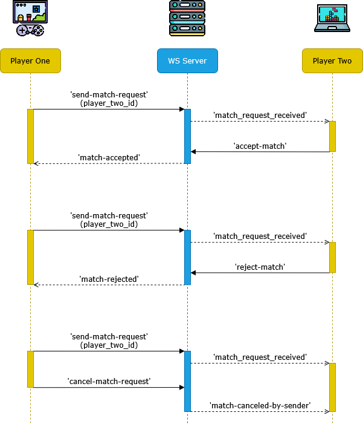

# Eventos de configuración del jugador (Player)

> Si necesitas volver al documento anterior, haz clic [aquí](./server-connect-and-use-es.md).

El servidor puede gestionar las solicitudes de partidas realizadas entre jugadores. En este caso, cada jugador
puede enviar solicitudes de partida a otros jugadores que se encuentren disponibles (`AVAILABLE`). Los jugadores
que reciben la solicitud pueden aceptar o rechazar la solicitud de partida como estimen conveniente. El jugador
que envía la solicitud también puede cancelarla si el jugador destinatario aún no ha respondido dentro del tiempo
establecido. Las solicitudes de partida expirarán al cabo de 30 segundos. En dicho caso, cuando se envie una
solicitud de cancelación, aprobación o rechazo, la solicitud fallará con el mensaje respectivo.

- [Resumen de eventos](#resumen-de-eventos)
- [Solicitud de partida recibida (match-request-received)](#solicitud-de-partida-recibida-match-request-received)
- [Partida cancelada por el remitente (match-canceled-by-sender)](#partida-cancelada-por-el-remitente-match-canceled-by-sender)
- [Solicitud de partida aceptada (match-accepted)](#solicitud-de-partida-aceptada-match-accepted)
- [Solicitud de partida rechazada (match-rejected)](#solicitud-de-partida-rechazada-match-rejected)
- [Enviar solicitud de partida (send-match-request)](#enviar-solicitud-de-partida-send-match-request)
- [Cancelar solicitud de partida (cancel-match-request)](#cancelar-solicitud-de-partida-cancel-match-request)
- [Aceptar solicitud de partida (accept-match)](#aceptar-solicitud-de-partida-accept-match)
- [Rechazar solicitud de partida (reject-match)](#rechazar-solicitud-de-partida-reject-match)

## Resumen de eventos

| Evento                     | Tipo     | Descripción                                                          |
|----------------------------|----------|----------------------------------------------------------------------|
| `match-request-received`   | Entrante | Avisa que recibiste una solicitud de partida.                        |
| `match-canceled-by-sender` | Entrante | Avisa que la solicitud de partida fue cancelada por el otro jugador. |
| `match-accepted`           | Entrante | Avisa que el otro jugador aceptó la solicitud de partida.            |
| `match-rejected`           | Entrante | Avisa que el otro jugador rechazó la solicitud de partida.           |
| `send-match-request`       | Saliente | Manda una solicitud de partida a un jugador disponible.              |
| `cancel-match-request`     | Saliente | Cancela la solicitud enviada al otro jugador.                        |
| `accept-match`             | Saliente | Acepta una solicitud de partida recibida.                            |
| `reject-match`             | Saliente | Rechaza una solicitud de partida recibida.                           |
 
<details>
<summary>Diagrama de secuencia de eventos</summary>



</details>

## Solicitud de partida recibida (match-request-received)

| Resumen         |                                                                                        |
|-----------------|----------------------------------------------------------------------------------------|
| __Evento__      | `match-request-received`                                                               |
| __Tipo__        | Evento entrante (_Listen_).                                                            |
| __Descripción__ | Evento que indica que se ha recibido una solicitud de partida por parte de un jugador. |
| __Respuesta__   | `playerId` (_string_): ID de jugador que ha enviado la solicitud de partida.           |
|                 | `matchId` (_string_): ID de la partida asociada a la solicitud.                        |

Este evento se recibe cuando otro jugador le ha enviado una solicitud de partida. Esta solicitud estará activa 
durante 30 segundos a menos que el jugador contrincante cancele la solicitud. Dentro de este tiempo, usted
puede aprobar o rechazar la solicitud con `accept-match` y `reject-match` respectivamente. Puede usar este
mensaje para abrir una ventana modal en su interfaz, con el fin que el jugador ejecute una de las dos acciones.
Este evento gatilla un cambio de estado, por lo que ambos jugadores pasan de estado disponible (`AVAILABLE`) a
ocupado (`BUSY`) y el resto de jugadores recibe el evento `player-status-changed` para ambos cambios.

Ejemplo de respuesta:
```jsonc
{
  "event": "match-request-received",
  "msg": "Match request received from player 'Player_One'",
  "data": {
    "playerId": "0f2cc688-dcf3-4952-b8f8-c52f75f316d4",
    "matchId": "30c3d082-bcd9-48b0-9a90-76212636bc6f"
  }
}
```

## Partida cancelada por el remitente (match-canceled-by-sender)

| Resumen         |                                                                         |
|-----------------|-------------------------------------------------------------------------|
| __Evento__      | `match-canceled-by-sender`                                              |
| __Tipo__        | Evento entrante (_Listen_).                                             |
| __Descripción__ | Evento que indica que se ha cancelado la solicitud de partida recibida. |
| __Respuesta__   | `playerId` (_string_): ID de jugador que ha enviado el mensaje.         |

Este evento se recibe cuando otro jugador le envió una solicitud de partida, pero la cancelo posteriormente.
Puede usar este mensaje para borrar la ventana modal de solicitud de partida. Al recibir este evento, también
se produce un cambio de estado para ambos jugadores, gatillando el evento `player-status-changed` para ambos
cambios de ocupado (`BUSY`) a disponible (`AVAILABLE`).

Ejemplo de respuesta:
```jsonc
{
  "event": "match-request-received",
  "msg": "Player 'Player_One' has cancelled the match request.",
  "data": {
    "playerId": "0f2cc688-dcf3-4952-b8f8-c52f75f316d4"
  }
}
```

## Solicitud de partida aceptada (match-accepted)

| Resumen         |                                                                                 |
|-----------------|---------------------------------------------------------------------------------|
| __Evento__      | `match-accepted`                                                                |
| __Tipo__        | Evento entrante (_Listen_).                                                     |
| __Descripción__ | Evento que indica que el jugador desafiado ha aceptado la solicitud de partida. |
| __Respuesta__   | `playerId` (_string_): ID de jugador que aceptó la solicitud de partida.        |
|                 | `matchId` (_string_): ID de la partida asociada a la solicitud.                 |
|                 | `matchStatus` (_string_): Estado de la partida.                                 |

Este evento se recibe cuando el jugador que ha desafiado aceptó la solicitud de partida. En este caso, el 
jugador puede usar este evento para pasar a una ventana de configuración o bien directamente a la escena
del multijugador. Este evento gatilla un cambio de estado, emitiendo el evento `player-status-changed` para
el resto de jugadores notificando el cambio de ocupado (`BUSY`) a en partida (`IN_MATCH`).

Ejemplo de respuesta:
```jsonc
{
  "event": "match-accepted",
  "msg": "Player 'Player_Two' has rejected your match request.",
  "data": {
    "playerId": "c3e5aca7-f1c0-40ed-8b5c-aac3f58d137f",
    "matchId": "97eb7a3c-1f9e-412a-b379-dc17d868b7a1",
    "matchStatus": "WAITING_PLAYERS"
  }
}
```

## Solicitud de partida rechazada (match-rejected)

| Resumen         |                                                                                  |
|-----------------|----------------------------------------------------------------------------------|
| __Evento__      | `match-rejected`                                                                 |
| __Tipo__        | Evento entrante (_Listen_).                                                      |
| __Descripción__ | Evento que indica que el jugador desafiado ha rechazado la solicitud de partida. |
| __Respuesta__   | `playerId` (_string_): ID de jugador que rechazó la solicitud.                   |

Este evento se recibe cuando el jugador que ha desafiado rechazó la solicitud de partida. Puede usar este
mensaje para borrar la ventana modal de solicitud de partida. También se gatilla un cambio de estado de
ocupado (`BUSY`) a disponible (`AVAILABLE`), notificando a todos los jugadores con el evento
`player-status-changed`.

Ejemplo de respuesta:
```jsonc
{
  "event": "match-rejected",
  "msg": "Player 'Player_Two' has rejected your match request.",
  "data": {
    "playerId": "c3e5aca7-f1c0-40ed-8b5c-aac3f58d137f"
  }
}
```

## Enviar solicitud de partida (send-match-request)

| Resumen         |                                                                         |
|-----------------|-------------------------------------------------------------------------|
| __Evento__      | `send-match-request`                                                    |
| __Tipo__        | Evento saliente (_Trigger_).                                            |
| __Descripción__ | Evento para enviar una solicitud de partida a otro jugador.             |
| __Parámetros__  | `playerId` (_string_): Identificador del jugador a enviar la solicitud. |
| __Respuesta__   | `matchId` (_string_): ID de la partida asociada a la solicitud.         |

Con este evento se envia una solicitud de partida a un jugador que se encuentre conectado al
servidor y que esté disponible para jugar. Esta solicitud le llega al jugador mediante el
evento [`match-request-received`](#solicitud-de-partida-recibida-match-request-received).
Solo se requiere el identificador del jugador en cuestión. En el caso que el jugador de
destino esté ocupado, en partida o no exista en la lista, se retornará un error. También se
recibirá un error si el jugador se envía una solicitud a si mismo o si es que no está
disponible.

Si no ocurre ningún error, se producirá un cambio de estado para ambos jugadores de disponible
(`AVAILABLE`) a ocupado (`BUSY`) y se emitirá el evento `player-status-changed` al resto de
jugadores.

Ejemplo de solicitud correcta:
```jsonc
// Evento enviado por el jugador
{
  "event": "send-match-request",
  "data": {
    "playerId": "c3e5aca7-f1c0-40ed-8b5c-aac3f58d137f",
  }
}

// Respuesta entregada por el servidor
{
  "event": "send-match-request",
  "status": "OK",
  "msg": "Match request sent to player 'Player_Two'.",
  "data": {
    "matchId": "30c3d082-bcd9-48b0-9a90-76212636bc6f"
  }
}
```

Ejemplo de solicitud incorrecta:
```jsonc
// Evento enviado por el jugador
{
  "event": "send-match-request",
  "data": {
    "playerId": "30c3d082-bcd9-48b0-9a90-76212636bc6f",
  }
}

// Respuesta entregada por el servidor si el jugador está ocupado
{
  "event": "send-match-request",
  "status": "ERROR",
  "msg": "Player 'Player_Two' is busy. Try again later.",
  "data": {
    "playerId": "30c3d082-bcd9-48b0-9a90-76212636bc6f",
    "playerStatus": "BUSY"
  }
}

// Respuesta entregada por el servidor si el jugador está en partida
{
  "event": "send-match-request",
  "status": "ERROR",
  "msg": "Player 'Player_Two' is in another match. Wait until this match ends.",
  "data": {
    "playerId": "30c3d082-bcd9-48b0-9a90-76212636bc6f",
    "playerStatus": "IN_MATCH"
  }
}

// Respuesta entregada por el servidor si el jugador no existe
{
  "event": "send-match-request",
  "status": "ERROR",
  "msg": "Player with id '30c3d082-bcd9-48b0-9a90-76212636bc6f' not exists.",
  "data": {
    "playerId": "30c3d082-bcd9-48b0-9a90-76212636bc6f"
  }
}

// Respuesta entregada por el servidor si el jugador se manda una solicitud a si mismo
{
  "event": "send-match-request",
  "status": "ERROR",
  "msg": "You cannot send a match request to yourself.",
  "data": {
    "playerId": "30c3d082-bcd9-48b0-9a90-76212636bc6f"
  }
}
```

## Cancelar solicitud de partida (cancel-match-request)

| Resumen         |                                                                        |
|-----------------|------------------------------------------------------------------------|
| __Evento__      | `cancel-match-request`                                                 |
| __Tipo__        | Evento saliente (_Trigger_).                                           |
| __Descripción__ | Evento para cancelar una solicitud de partida enviada.                 |
| __Parámetros__  | Ninguno.                                                               |
| __Respuesta__   | `playerId` (_string_): ID del jugador que canceló la solicitud.        |

Este evento sirve para cancelar una solicitud de partida que el jugador haya enviado a otro, haciendo
que reciba el evento [`match-canceled-by-sender`](#partida-cancelada-por-el-remitente-match-canceled-by-sender).
Esto elimina la solicitud de partida, por lo que el jugador de destino no puede aceptarla. El evento
cambia el estado de ambos jugadores de ocupado (`BUSY`) a disponible (`AVAILABLE`), lo que permite
que ambos puedan volver a recibir solicitudes de partida. El resto de jugadores son notificados de
los cambios con el evento `player-status-changed`.

El evento puede provocar un error si la partida no existe o si esta fue aprobada con anticipación por
el jugador de destino.

En caso de ser el jugador que recibió una solicitud de partida, esta no se puede rechazar con este
evento. Para eso, se debe llamar al evento [`reject-match`]().

Ejemplo de solicitud correcta:
```jsonc
// Evento enviado por el jugador
{
  "event": "cancel-match-request"
}

// Respuesta entregada por el servidor
{
  "event": "cancel-match-request",
  "status": "OK",
  "msg": "The match request to player 'Player_Two' has been cancelled.",
  "data": {
    "playerId": "30c3d082-bcd9-48b0-9a90-76212636bc6f"
  }
}
```

Ejemplo de solicitudes incorrectas:
```jsonc
// Evento enviado por el jugador
{
  "event": "cancel-match-request"
}

// Respuesta entregada por el servidor si la partida no existe
{
  "event": "cancel-match-request",
  "status": "ERROR",
  "msg": "You do not have an active match request.",
  "data": {
    "playerStatus": "AVAILABLE"
  }
}

// Respuesta entregada por el servidor si la partida ya inició
{
  "event": "cancel-match-request",
  "status": "ERROR",
  "msg": "Match is in progress and cannot be cancelled or rejected.",
  "data": {
    "matchId": "30c3d082-bcd9-48b0-9a90-76212636bc6f",
    "matchStatus": "WAITING_PLAYERS"
  }
}

// Respuesta entregada por el servidor si se intenta cancelar una solicitud recibida
{
  "event": "cancel-match-request",
  "status": "ERROR",
  "msg": "You cannot cancel an incoming match request. You need to reject it with the event 'reject-match'.",
  "data": {
    "matchId": "30c3d082-bcd9-48b0-9a90-76212636bc6f",
    "matchStatus": "REQUESTED"
  }
}
```

## Aceptar solicitud de partida (accept-match)

| Resumen         |                                                                        |
|-----------------|------------------------------------------------------------------------|
| __Evento__      | `accept-match`                                                         |
| __Tipo__        | Evento saliente (_Trigger_).                                           |
| __Descripción__ | Evento para aceptar una solicitud de partida recibida.                 |
| __Parámetros__  | Ninguno.                                                               |
| __Respuesta__   | `matchId` (_string_): ID de la partida asociada a la solicitud.        |
|                 | `matchStatus` (_string_): Estado de la partida.                        |

Este evento permite aceptar una solicitud de partida recibida. Cuando se manda el evento, el
estado de la partida cambia de `REQUESTED` a `WAITING_CONNECTION`, y tanto el jugador como el
oponente deben conectarse a la partida con el evento `connect-match`. También se actualiza el
estado de los jugadores de `BUSY` a `IN_MATCH`, notificando al resto de jugadores con el evento
`player-status-changed`.

Este evento puede provocar error si el jugador no tiene una partida asociada, cuando la partida
ya fue aprobada por el jugador o si se intenta aprobar una solicitud enviada por el mismo jugador.

Ejemplo de solicitud correcta:
```jsonc
// Evento enviado por el jugador
{
  "event": "accept-match"
}

// Respuesta entregada por el servidor
{
  "event": "accept-match",
  "status": "OK",
  "msg": "The match request from player 'Player_Two' has been accepted.",
  "data": {
    "matchId": "30c3d082-bcd9-48b0-9a90-76212636bc6f",
    "matchStatus": "WAITING_PLAYERS"
  }
}
```

Ejemplo de solicitudes incorrectas:
```jsonc
// Evento enviado por el jugador
{
  "event": "accept-match"
}

// Respuesta entregada por el servidor si la partida no existe
{
  "event": "accept-match",
  "status": "ERROR",
  "msg": "You do not have an active match request.",
  "data": {
    "playerStatus": "AVAILABLE"
  }
}

// Respuesta entregada por el servidor si la partida ya inició
{
  "event": "accept-match",
  "status": "ERROR",
  "msg": "Match is in progress and cannot be cancelled or rejected.",
  "data": {
    "matchId": "30c3d082-bcd9-48b0-9a90-76212636bc6f",
    "matchStatus": "WAITING_PLAYERS"
  }
}

// Respuesta entregada por el servidor si se intenta aceptar una solicitud enviada
{
  "event": "accept-match",
  "status": "ERROR",
  "msg": "You cannot accept a match request you have sent.",
  "data": {
    "matchId": "30c3d082-bcd9-48b0-9a90-76212636bc6f",
    "matchStatus": "REQUESTED"
  }
}
```

## Rechazar solicitud de partida (reject-match)

| Resumen         |                                                                          |
|-----------------|--------------------------------------------------------------------------|
| __Evento__      | `reject-match`                                                           |
| __Tipo__        | Evento saliente (_Trigger_).                                             |
| __Descripción__ | Evento para rechazar una solicitud de partida recibida.                  |
| __Parámetros__  | Ninguno.                                                                 |
| __Respuesta__   | `playerId` (_string_): ID del jugador que mandó la solicitud de partida. |

Este evento permite rechazar una solicitud de partida que haya recibido el jugador. Con esta
acción, la partida asociada se elimina de ambos jugadores, el jugador oponente recibe una
notificación del rechazo de la solicitud, y todos los jugadores del lobby reciben un aviso del
cambio de estado de ambos jugadores, de `BUSY` a `AVAILABLE`.

Este evento puede retornan un error si el jugador no tiene una partida asociada, si la partida
ya fue aprobada por el jugador o si se intenta aprobar una solicitud enviada por el mismo jugador.

Ejemplo de solicitud correcta:
```jsonc
// Evento enviado por el jugador
{
  "event": "reject-match"
}

// Respuesta entregada por el servidor
{
  "event": "reject-match",
  "status": "OK",
  "msg": "The match request from player 'Player_Two' has been rejected.",
  "data": {
    "playerId": "30c3d082-bcd9-48b0-9a90-76212636bc6f"
  }
}
```

Ejemplo de solicitudes incorrectas:
```jsonc
// Evento enviado por el jugador
{
  "event": "reject-match"
}

// Respuesta entregada por el servidor si la partida no existe
{
  "event": "reject-match",
  "status": "ERROR",
  "msg": "You do not have an active match request.",
  "data": {
    "playerStatus": "AVAILABLE"
  }
}

// Respuesta entregada por el servidor si la partida ya inició
{
  "event": "reject-match",
  "status": "ERROR",
  "msg": "Match is in progress and cannot be cancelled or rejected.",
  "data": {
    "matchId": "30c3d082-bcd9-48b0-9a90-76212636bc6f",
    "matchStatus": "WAITING_PLAYERS"
  }
}

// Respuesta entregada por el servidor si se intenta rechazar una solicitud enviada
{
  "event": "reject-match",
  "status": "ERROR",
  "msg": "You cannot reject a match request you have sent. You need to cancel it with the event 'cancel-match-request'.",
  "data": {
    "matchId": "30c3d082-bcd9-48b0-9a90-76212636bc6f",
    "matchStatus": "REQUESTED"
  }
}
```
